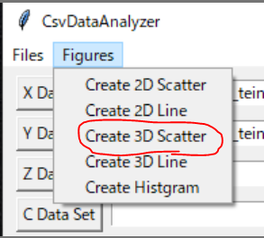
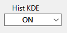

# CsvDataAnalyzer
A CSV file data analyzer using pure Python.  

## Table of contents

## About this repository
This is a CSV file data analyzer based on Python.  

Features:  

1. Easy to use.  
2. Statistics(Sum, Mean, Std, Max and Min) of each data are calculated automatically.  
3. It can create multiple 2/3D graph.  

## Gallery
* Launched on Windows 10


## Requirements
* Python 3.6.x or higher
* matplotlib
* mpl_toolkits
* numpy
* seaborn
* pandas
* tkinter

## Getting Started
1. Clone this repository.
2. Install required libraries.
3. Execute the following command and a GUI will be opened.
```shell script
$ python src/CsvDataAnalyzer.py
```


## How to use

### Reading CSV file
* "Files" at left top of GUI -> "Read csv file"  
  

* A file dialog will be oped.  
* Multiple CSV files can be selected too.
  

* Reading will finish like this.  


### Calculating Statics
* Max, Min, Mean and Sigma(Std) will be calculated automatically.  
* Those values are displayed on GUI.  


### Creating Graph
* Select data you want to analyze on GUI.  
* Selected data is colored blue by left click.  


* Set data to X axis by pushing "X Data Set".  


* Set another data to Y axis by pushing "Y Data Set".  


* Select plot color from pull-down menu.  


### 2D Line Graph
* After setting data, select "Create 2D Line" from "Figures" menu.  
  

* A empty figure will be opened.  


* On the figure, click the right button. -> The 2D line graph will be shown.  


* Another data can be shown on the same figure.  


### 2D Scatter Graph
* After setting data, select "Create 2D Scatter" from "Figures" menu.  
  

* By following the above procedure, the 2D scatter graph will be shown.  
  

* By setting a color data to "C Data Set", a heatmap can be created.  
  


* You can set min/max velues of color bar.  


### 3D Line Graph
* After setting data, select "Create 3D Line" from "Figures" menu.  
  

* Set another data to "Z Data Set".  


* By following the above procedure, a 3D line graph will be shown.  


### 3D Scatter Graph
* After setting data, select "Create 3D Scatter" from "Figures" menu.  
  

* By following the above procedure, a 3D scatter graph will be shown.  
  

* 3D heatmap can be created too.  


### Histogram
* After setting data, select "Create 3D Histgram" from "Figures" menu.  
  

* This histogram shows X data distribution.  
  

### Axis Equal
* You can switch ON/OFF from a pull-down menu "Axis Equal"".  
  

### Kernel Density Estimation
* When a histogram graph is created, you can show a kernel density function together.  
  

* You can switch ON/OFF from a pull-down menu "Hist KDE".  
  

## License
MIT

## Author
* [Shisato Yano](https://github.com/ShisatoYano)([@4310sy](https://twitter.com/4310sy))
