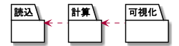

# データ解析ツールのドメインモデル設計

## データ解析業務の分析
* 業務の関心事の要点をうまく説明する
* クラス名やメソッド名を業務で使う用語の単位と一致させる設計をまず行う
* 関心事をヒト、モノ、コトに分類する
* コトに注目して整理する
* ツールを用いた解析における、時間軸に沿った一連の出来事の発生
### コト
* ツールを用いた解析における、時間軸に沿った一連の出来事の発生
* CsvDataAnalyzerの場合なら、大きく分けて下記の3つ
1. 読込
2. 統計
3. 可視化
### ヒト
* 業務活動の当事者
* 今回の場合だと、本ツールを使うユーザー
### モノ
* ヒトが業務を遂行するときの関心の対象
* ユーザーが本ツールを使って解析をするときの関心事
#### 読込
* データが記録されたCSVファイル
* 読み込まれたデータの概要
#### 統計
* 各データの最大値
* 各データの最小値
* 各データの平均値
* 各データの標準偏差
#### 可視化
* データの種類
* グラフの種類
* グラフの色
* グラフのマーカータイプ
* グラフのアスペクト比
* ヒートマップの色分けに使うデータの種類
* ヒートマップ色分けデータの最大/最小値

## パッケージ図で全体構成を俯瞰する
* 個々の細かいクラス設計を隠ぺいして、パッケージ単位で全体の構成を俯瞰する
  

## 業務フロー図で全体の流れを把握する
* 業務の様々な活動を、時間軸に沿って図示したもの
* 活動の主体ごとにレーンを並べて、それぞれの間での情報のやり取りを明らかにする
* クラス候補を見つけるときに、業務の流れに沿って登場するオブジェクトとして発見できる
  

## 全体を俯瞰した後にやる作業
* 重要な部分(間違いなく必要になる部分)を探す
* 重要なものから順に、独立したドメインオブジェクトとして開発していく
* プログラムとしてうまく記述できる設計クラスを見つける
* クラス名やメソッド名を、業務で使う用語の単位と一致させる設計を行う

