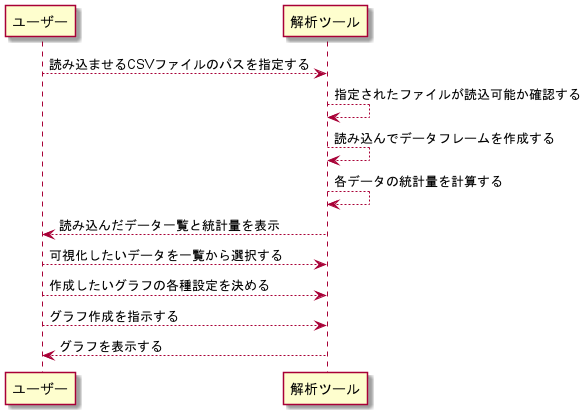

# データ解析ツールのドメインモデル設計

## データ解析業務の分析
* 業務の関心事の要点をうまく説明する
* クラス名やメソッド名を業務で使う用語の単位と一致させる設計をまず行う
* 関心事をヒト、モノ、コトに分類する
* コトに注目して整理する
* ツールを用いた解析における、時間軸に沿った一連の出来事の発生
### コト
* ツールを用いた解析における、時間軸に沿った一連の出来事の発生
* CsvDataAnalyzerの場合なら、大きく分けて下記の3つ
1. 読込
2. 統計
3. 可視化
### ヒト
* 業務活動の当事者
* 今回の場合だと、本ツールを使うユーザー
### モノ
* ヒトが業務を遂行するときの関心の対象
* ユーザーが本ツールを使って解析をするときの関心事
#### 読込
* ファイルのパス
* ファイルの形式
* 読込可否
* 読込内容
#### 計算
* 各データの最大値
* 各データの最小値
* 各データの平均値
* 各データの標準偏差
#### 可視化
* データの種類
* グラフの種類
* グラフの色
* グラフのマーカータイプ
* グラフのアスペクト比
* ヒートマップの色分けに使うデータの種類
* ヒートマップ色分けデータの最大/最小値

## パッケージ図で全体構成を俯瞰する
* 個々の細かいクラス設計を隠ぺいして、パッケージ単位で全体の構成を俯瞰する  
  

## 業務フロー図で全体の流れを把握する
* 業務の様々な活動を、時間軸に沿って図示したもの
* 活動の主体ごとにレーンを並べて、それぞれの間での情報のやり取りを明らかにする
* クラス候補を見つけるときに、業務の流れに沿って登場するオブジェクトとして発見できる  
  

## 全体を俯瞰した後にやる作業
* 重要な部分(間違いなく必要になる部分)を探す
* 重要なものから順に、独立したドメインオブジェクトとして開発していく
* プログラムとしてうまく記述できる設計クラスを見つける
* クラス名やメソッド名を、業務で使う用語の単位と一致させる設計を行う

## アプリケーション層のクラスの役割
* 処理の流れの進行役であり、調整役
* プレゼンテーション層からの依頼を受ける
* 適切なドメインオブジェクトに判断/加工/計算を依頼する
* プレゼンテーション層に結果(ドメインオブジェクト)を返す
* データソース層に記録や通知の入出力を指示する
* この層のクラスをサービスクラスという  


### サービスクラスの例: 注文処理
```java
class OrderRegisterService {
    OrderRepository repository;
    
    void register(Order order) {
        repository.register(order);
    }
}
```

### サービスクラスを作りながらドメインモデルを改善する
* メソッドが複雑になってきたら、複数のメソッドに分けるなどの部品化を考える
* データベースとの入出力が入り組んできて、処理の流れがデータベース操作の手続きになり始めたら、リポジトリの設計やドメインオブジェクトの設計を見直す
* サービスクラスのコードをシンプルに保つようなクラスの役割分担を心がける

### サービスクラスの設計
* まずは、独立性の高い部品に分けることを考える
* 登録系のサービスと参照系のサービスを分ける
#### 登録系
* プレゼンテーション層から渡された情報を検証する
* 加工や計算を行ったうえで、記録したり通知する
#### 参照系
* プレゼンテーション層の依頼に基づき情報を生成する
* 生成した情報をプレゼンテーション層に戻す
#### 更新と参照を分離する設計
```java
class BankAccountService {
    BankAccountRepository repository;
    
    Amount balance() {
        return repository.balance();
    }
    
    boolean canWithdraw(Amount amount) {
        Amount balance = balance();
        return balance().has(amount);
    }
}

class BankAccountUpdateService {
    BankAccountRepository repository;
    
    void withdraw(Amount amount) {
        repository.withdraw(amount);
    }
}
```
#### 組み合わせ用のサービスクラスを作る
* 基本サービスを組み合わせた複合サービスを表現するためにシナリオクラスを作る
```java
class BankAccountScenario {
    BankAccountService queryService;
    BankAccountUpdateService updateService;
    
    Amount withdraw(Amount amount) {
        if(! querySerive.canWithdraw(amount))
            throw new IllegalStateException("残高不足");
        updateService.withdraw(amount);
        return queryService.balance();
    }
}
```

### 契約による設計
* サービスを利用する側と提供する側とで、サービス提供ごとの約束事を決め、設計をシンプルに保つ技法
* プログラムの異常な処理を防止するための設計の基本原則
* 内部のデータ状態を外部から隠ぺいする
* プレゼンテーション層と、どういう約束事でサービスを提供するかを決めるのが重要
* nullを渡さない/nullを返さない
* 状態に依存する場合、使う側が事前に確認する
* 約束を守ったうえでさらに異常が起きた場合、例外で通知する

### データベースの都合から分離する
* 業務の視点からの記録と参照の関心事をリポジトリとして宣言する
* リポジトリは、ドメインオブジェクトの保管と取り出しができる収納場所
* 全てのドメインオブジェクトをメモリ上に保管して、いつでも取り出せるしくみ
* リポジトリを使った業務データの記録と参照は、データベース操作ではなく、業務の関心事として記述するための工夫
* サービスクラスの中からは、リポジトリを利用して業務データの記録や参照を行う
* リポジトリのメソッド名/引数/返す値は、全て業務の用語で表現する
```java
class BankAccountDatasource implements BankAccountRepository {
    boolean canWithdraw(Amount amount) {
        // データベースに残高を照会して結果を返す
    }
    
    Amount balance() {
        // データベースに残高を照会して結果を返す
    }
    
    void withdraw(Amount amount) {
        // データベースの残高を変更する
    }
}
```

## データベースの設計
### 基本的な工夫を丁寧に実践する
* 名前を省略しない
* 適切なデータ型を使う
* 制約をきちんと使う
### 3つの制約
* NOT NULL制約: データベースは既知の事実を記録するもの。NULLは「未知」なので掟破り
* 一意性制約: 重複したデータを記録させない
* 外部キー制約: 分割されたテーブル間の関連付けを保証する
### コトに注目する
* 現実に起きたコトを記録する
* 将来起きるコトを記録する(約束の記録)
### 記録タイミングの異なるデータはテーブルを分ける
* NULLが入らないようにするため
* 分けたテーブル間の関係を明示するために外部キー制約を使う
### 記録の変更を禁止する
* まず過去の記録の「取り消し」を記録する
* そして、修正する事実を別の記録として追加する
* 元データ、取り消しデータ、新データの3つの記録が残る
### カラムの追加はテーブルを追加する
* 元のテーブルはそのまま利用する
* 追加するデータ項目をカラムに持つテーブルを新しく作る
* 追加したテーブルから元のテーブルに外部キー制約を宣言する

## 画面とドメインオブジェクトの設計の連動
* 画面に引きずられた設計はソフトウェアの変更を大変にする
* 用途ごとのシンプルな画面に分ける
* 画面まわりのロジックから業務ロジックを分離する
